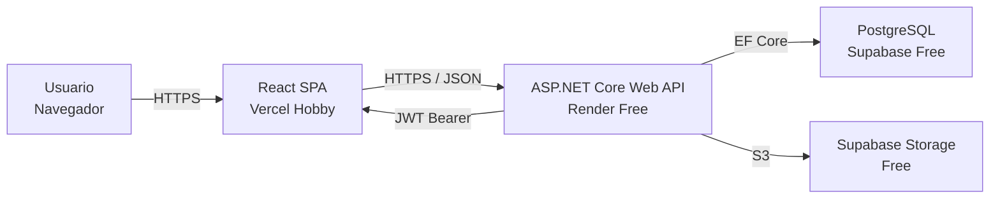
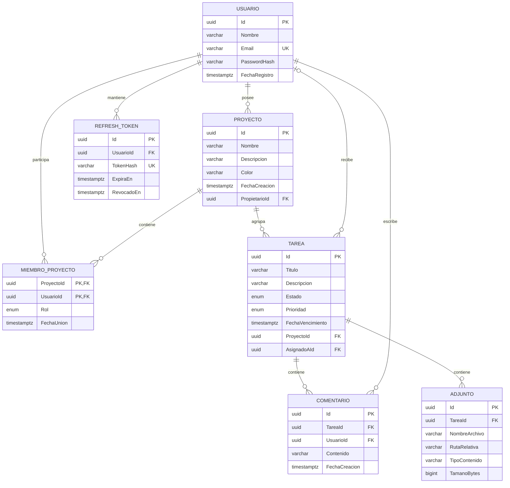

# TaskRino — Gestor de proyectos y tareas

Proyecto final de Tecnología de Internet II. TaskRino es una aplicación web full-stack tipo Trello/Asana simplificado para organizar proyectos, tareas, miembros, comentarios y adjuntos. Su lema es: **“Fuerza para tus proyectos, orden para tus días”**.

## Arquitectura



La solución sigue la arquitectura propuesta en la asignación: el navegador ejecuta una SPA React independiente; la SPA consume por HTTPS una API REST ASP.NET Core protegida con JWT; y la API persiste los datos mediante EF Core en PostgreSQL. Supabase Storage se usa únicamente para que los adjuntos sobrevivan a los reinicios del backend gratuito.

## Estado de los requisitos

- API REST versionada bajo `/api/v1` con DTOs, validación, ProblemDetails y Swagger.
- Registro, login, refresh token con rotación, logout y contraseñas con `PasswordHasher<T>`.
- Autorización contextual por proyecto: Owner, Editor y Viewer.
- CRUD de proyectos y tareas, filtros, paginación y cambio rápido de estado.
- Invitación, cambio de rol y eliminación de miembros.
- Comentarios y adjuntos de imágenes/PDF de hasta 5 MB con validación MIME y firma del archivo.
- React funcional con Hooks, Context API, rutas protegidas e interceptor Axios para JWT/refresh.
- Dashboard, Kanban responsivo, detalle de tarea, miembros, perfil, carga, errores, estados vacíos y 404.
- Migración EF Core inicial, 2 usuarios, 2 proyectos y 5 tareas de demostración.
- Dockerfile, Blueprint de Render, configuración de Vercel y almacenamiento S3 compatible.
- Pruebas automatizadas de tokens y autorización contextual.

## Estructura

```text
gestor-tareas-api/         ASP.NET Core Web API (.NET 8)
gestor-tareas-api.tests/   Pruebas xUnit
gestor-tareas-spa/         React + Vite
render.yaml                Backend gratuito en Render
docker-compose.yml         PostgreSQL local
GestorTareas.sln           Solución .NET (Visual Studio 2026 / SDK 8)
```

## Modelo entidad-relación



## Ejecución local

Requisitos: .NET SDK 8+, Node.js 20+ y Docker Desktop o PostgreSQL 16.

1. Iniciar PostgreSQL:

   ```powershell
   docker compose up -d postgres
   ```

2. Iniciar la API:

   ```powershell
   dotnet run --project gestor-tareas-api
   ```

   La consola muestra la URL local. Swagger está en `/swagger` y el health check en `/health`. Al iniciar, la API aplica las migraciones pendientes, sincroniza las dos cuentas de demostración de TaskRino y crea los proyectos semilla cuando corresponda.

3. En otra terminal, iniciar la SPA:

   ```powershell
   Set-Location gestor-tareas-spa
   Copy-Item .env.example .env
   npm install
   npm run dev
   ```

4. Abrir `http://localhost:5173`.

## Usuarios de prueba

| Usuario | Contraseña | Rol inicial |
|---|---|---|
| `severino@rino.com` | `S3ver1n0` | Owner en Lanzamiento / Viewer en Rediseño |
| `richard@rino.com` | `R1ch@rd` | Editor en Lanzamiento / Owner en Rediseño |

Estas credenciales son solo para la demostración académica.

## Despliegue completamente gratuito

La combinación recomendada en agosto de 2026 es:

- SPA: Vercel Hobby, USD 0, HTTPS y despliegue continuo.
- API: Render Web Service Free, USD 0, Docker y HTTPS.
- PostgreSQL + archivos: Supabase Free, USD 0, 500 MB de base y 1 GB de Storage.

No se recomienda Render Postgres Free para la entrega: su base gratuita expira a los 30 días. Tampoco se guardan adjuntos en el disco local de Render, porque el sistema de archivos gratuito es efímero.

### 1. Supabase Free

1. Crear un proyecto Free sin agregar tarjeta.
2. Copiar la cadena PostgreSQL desde **Connect**; para Render normalmente conviene el pooler IPv4 de sesión.
3. En **Storage**, crear un bucket privado llamado `adjuntos`.
4. En **Storage → S3**, habilitar S3 y generar Access Key, Secret Key, endpoint y región. Estas credenciales son exclusivas del backend.

### 2. Render Free para la API

1. Subir el monorepo a GitHub.
2. En Render: **New → Blueprint** y seleccionar el repositorio. `render.yaml` crea el servicio Free.
3. Completar las variables marcadas como secretas:

   | Variable | Valor |
   |---|---|
   | `ConnectionStrings__DefaultConnection` | Cadena PostgreSQL de Supabase con SSL |
   | `CORS_ORIGINS` | URL final de Vercel, por ejemplo `https://taskrino.vercel.app` |
   | `Storage__Endpoint` | Endpoint S3 de Supabase |
   | `Storage__Region` | Región indicada por Supabase |
   | `Storage__AccessKey` | Access Key S3 |
   | `Storage__SecretKey` | Secret Key S3 |

4. Elegir siempre **Free**. Render genera `Jwt__Key` automáticamente desde el Blueprint.
5. Probar `https://TU-API.onrender.com/health` y `https://TU-API.onrender.com/swagger`.

El servicio Free se duerme después de un periodo sin tráfico; la primera petición puede tardar cerca de un minuto. Esto es aceptable para una demostración académica y evita pagos.

### 3. Vercel Hobby para la SPA

1. Importar el mismo repositorio en Vercel.
2. Configurar **Root Directory** como `gestor-tareas-spa` y framework **Vite**.
3. Crear `VITE_API_URL=https://TU-API.onrender.com/api/v1`.
4. Seleccionar el plan **Hobby** y desplegar.
5. Copiar la URL final a `CORS_ORIGINS` en Render y volver a desplegar la API.

Vercel Hobby limita el uso al cupo gratuito en lugar de cobrar consumo adicional. No activar pruebas Pro, bases de datos de pago, dominios comprados ni discos persistentes de Render.

## URLs de producción

Completar después del primer despliegue:

- SPA: `PENDIENTE — https://________.vercel.app`
- API: `PENDIENTE — https://________.onrender.com`
- Swagger: `PENDIENTE — https://________.onrender.com/swagger`

## Verificación

```powershell
dotnet test GestorTareas.sln
Set-Location gestor-tareas-spa
npm run build
npm audit
```

## Seguridad y secretos

`.env`, configuraciones de producción y archivos subidos están ignorados por Git. Nunca confirmar cadenas de conexión, claves JWT ni credenciales S3. En desarrollo la API genera una clave JWT efímera si no se proporciona una; en producción `Jwt__Key` es obligatorio y Render lo genera fuera del repositorio.

## Documentación por componente

- [API](./gestor-tareas-api/README.md)
- [SPA](./gestor-tareas-spa/README.md)
